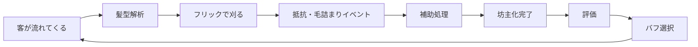
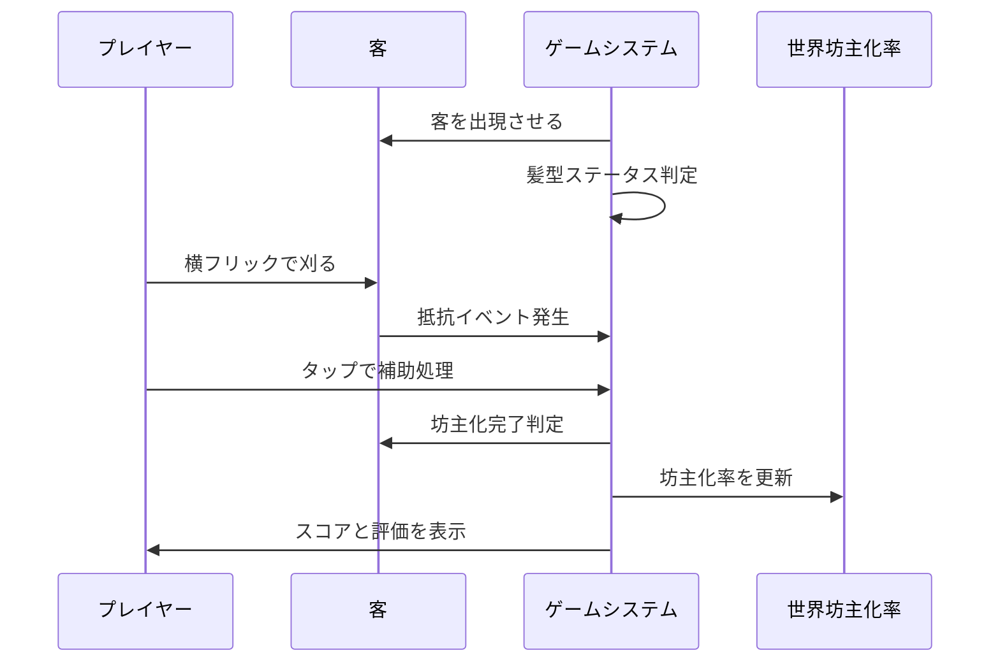

# 03 Core Loop

## ゲーム全体ループ

```mermaid
flowchart LR
  A[客が流れてくる] --> B[髪型解析]
  B --> C[フリックで刈る]
  C --> D[抵抗・毛詰まりイベント]
  D --> E[補助処理]
  E --> F[坊主化完了]
  F --> G[評価]
  G --> H[バフ選択]
  H --> A
```

## 1客処理シーケンス

```mermaid
sequenceDiagram
  participant Player as プレイヤー
  participant Customer as 客
  participant System as ゲームシステム
  participant World as 世界坊主化率
  System->>Customer: 客を出現させる
  System->>System: 髪型ステータス判定
  Player->>Customer: 横フリックで刈る
  Customer->>System: 抵抗イベント発生
  Player->>System: タップで補助処理
  System->>Customer: 坊主化完了判定
  System->>World: 坊主化率を更新
  System->>Player: スコアと評価を表示
```
