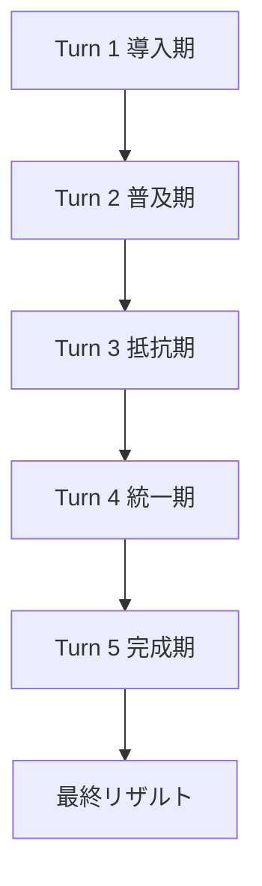

# 04 Turn Structure

## 進行条件
- 1ターン: 30〜60秒
- 全5ターン
- 1ラン: 3〜5分

## 5ターン進行

```mermaid
flowchart TD
  T1[Turn 1 導入期] --> T2[Turn 2 普及期]
  T2 --> T3[Turn 3 抵抗期]
  T3 --> T4[Turn 4 統一期]
  T4 --> T5[Turn 5 完成期]
  T5 --> R[最終リザルト]
```

## 難易度変化
- T1: 通常客中心
- T2: 政策イベント増
- T3: 抵抗イベント増
- T4: 高密度処理＋炎上要素
- T5: 有名人ラッシュと最終評価
