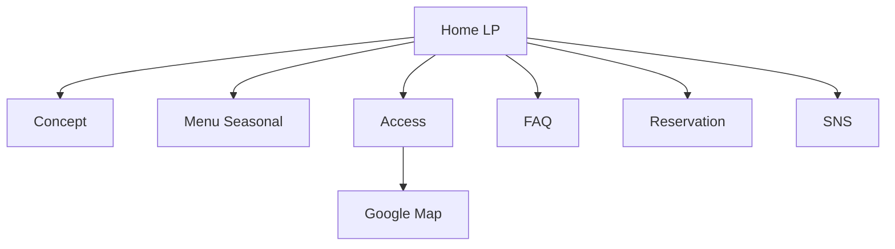

# 13 Information Architecture
## 1ページLP案
初回は空気感訴求と来店導線に集中。

## 複数ページ案
Menu詳細 / About / Journal / Events / Reservation。

## 初期採用
1ページLP + メニューJSON参照。

## 将来追加ページ
イベント、会員案内、スタッフノート。

## 導線
- ナビ: Concept/Menu/Access/FAQ
- CTA: 予約・問合せ
- SNS: Instagram（更新通知）
- Map: Google Map直リンク

