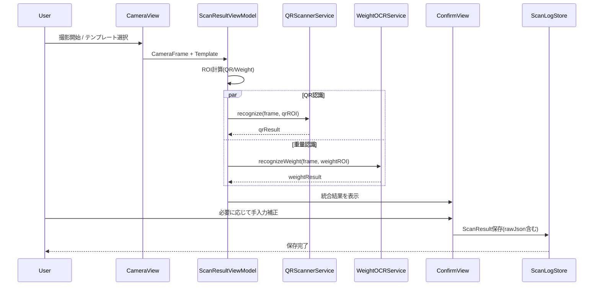

# 02 詳細設計（Flow / Sequence / State）

## シーケンス図（Mermaid）


## フローチャート（Mermaid）
```mermaid
flowchart TD
    A[撮影画面表示] --> B[テンプレート選択]
    B --> C[ROI算出]
    C --> D[QR認識]
    C --> E[重量認識(モック)]
    D --> F[結果統合]
    E --> F
    F --> G{認識値に不明あり?}
    G -- はい --> H[確認画面で手入力補正]
    G -- いいえ --> I[確認画面で確認]
    H --> J[JSON生成]
    I --> J
    J --> K[保存]
```

## 状態遷移
- `idle` → `scanning` → `recognized` → `confirming` → `saved`
- 例外時: `scanning` → `recognized(withUnknown)` → `confirming`

## 入出力定義
- 入力: `CameraFrame`, `LayoutTemplate`
- 出力: `ScanResult` + `rawJson`

## Human Review Gate #3（詳細設計レビュー）
- レビュー観点:
  - フローの破綻有無
  - 例外パス（不明値時）の成立
  - 保存前確認必須の担保
- 承認条件:
  - シーケンスと状態遷移が矛盾しない
