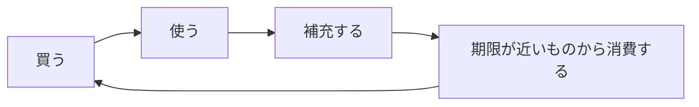

# stock-rotation-model.md

## ローリングストック運用モデル

### 基本サイクル
1. 買う
2. 使う
3. 補充する
4. 期限が近いものから消費する

## 実運用ルール（簡易）
- 月1回：在庫点検（主食・タンパク質・汁物・味変）
- 週1回：期限が近いものを優先して献立へ投入
- 買い足し時：使った分＋不足カテゴリを補充

## カテゴリ別の役割
- 主食：パックご飯を軸固定
- タンパク質：缶詰・レトルトで補強
- 温度感：フリーズドライ味噌汁・スープ
- 継続性：味変調味料で飽きを回避

## 失敗パターンと予防
- 失敗：買って終わる
  - 予防：週次で「消費優先リスト」を作る
- 失敗：同じ味で停滞
  - 予防：味変レイヤーを最低2種類常備
- 失敗：主食だけ余る
  - 予防：主食1に対してタンパク質/汁物の比率目安を設定
