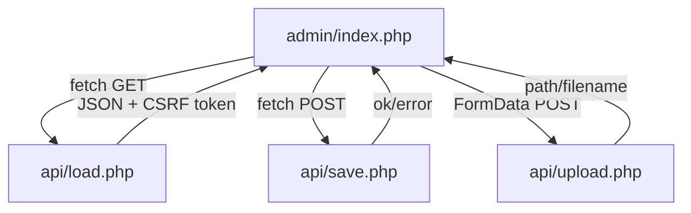

# Xserver × PHP × JSON 管理UI 設計書

## ディレクトリ構成 (デプロイ先 `/public_html`)
```
/public_html/
  ├─ index.html              # 案内ページ
  ├─ .htaccess               # ディレクトリリスティング禁止/セキュリティヘッダ
  ├─ api/
  │    ├─ load.php           # JSON 読み込み
  │    ├─ save.php           # JSON 保存
  │    └─ upload.php         # 画像アップロード & 採番
  ├─ data/
  │    ├─ sake.json          # 日本酒データ
  │    ├─ menu.json          # メニューデータ
  │    └─ .htaccess          # 直リンク抑止・no-store
  ├─ images/                 # アップロード先 (705/755 推奨)
  └─ admin/
       ├─ index.php          # 管理UI本体 (vanilla JS)
       └─ DESIGN.md          # 本ドキュメント
```

## API 仕様

- **CSRF**: `load.php` でセッション開始・token 発行。`save.php` / `upload.php` は `token` が一致しないと 403。
- **CORS**: `HTTP_ORIGIN` のホストが `HTTP_HOST` と一致する場合のみ `Access-Control-Allow-Origin` を返却。
- **エラー処理**: 400/403/405/500 を明示。メッセージは JSON `error` に格納。

### パラメータ
- `load.php?dataset=sake|menu`
- `save.php` (POST `application/x-www-form-urlencoded`)
  - `dataset`: `sake` or `menu`
  - `token`: CSRF トークン
  - `data`: JSON 文字列 (配列)
- `upload.php` (POST `multipart/form-data`)
  - `dataset`: `sake` or `menu`
  - `token`: CSRF トークン
  - `image`: 画像ファイル (jpg/png/gif)

### 画像ファイル名採番
- `upload.php` 内 `nextFilename()` が `sake001.jpg` → `sake002.jpg` のように 3 桁ゼロ埋め。
- dataset=`sake` は `sake###.ext`、それ以外は `img###.ext`。
- MIME + 拡張子一致チェック、`move_uploaded_file` 後に `0644` へ chmod。

## 管理UI 画面構成
- **画面ID**: `ADMIN01`
- **ワイヤー**: 上段に dataset 切替 + ステータス、中央に一覧/並び替えテーブル、下段にフォーム (新規・編集) + 画像プレビュー。
- **イベント一覧**
  - `dataset` change → JSON 再読込、フォーム項目の切替。
  - `▲/▼` → display_order 更新 + 再描画。
  - `編集` → フォームへ値差し替え。
  - `削除` → 配列から削除 → display_order 再採番。
  - `submit` → 画像があればアップロード → JSON 合体 → `save.php` へ保存。
  - `再読込` → `load.php` を強制再取得。
- **必須/任意フィールド**
  - sake: `id/name/region/abv/description/display_order` 必須、`image` 任意。
  - menu: `id/name/price/display_order` 必須、`tags/image` 任意。
- **表示例 JSON**: `data/sake.json`, `data/menu.json` を参照。

## よくあるトラブルと対策
- **文字化け**: `.htaccess` で `AddDefaultCharset UTF-8`。PHP のヘッダも `charset=UTF-8` 指定。
- **権限**: `data/*.json` → 604/644、`images/` ディレクトリ → 705/755 推奨。
- **パスずれ**: 返却パスは相対 `images/xxxx.jpg`。HTML 側は `../` を付与してプレビュー。
- **画像が表示されない**: MIME/拡張子不一致で 400。`Header set X-Content-Type-Options "nosniff"` でブラウザ強制判定を抑止。

## テストシナリオ
1. **新規JSON作成**: admin からアイテムを追加 → 保存 → `data/*.json` をダウンロードして内容確認。
2. **画像アップロード**: file input 選択 → 送信後レスポンス `path` が `images/sake00X.jpg` になっていること、`images/` に実ファイル生成を確認。
3. **並び替え**: 一覧で `▲/▼` を操作 → `display_order` が 1,2,... で連番になっていることを保存後ファイルで確認。
4. **保存後反映**: `再読込` でサーバー上 JSON を再取得し、一覧に新しい値が反映されること。

## 改善案 (必要に応じて)
- `X-Frame-Options` や `Content-Security-Policy` を `.htaccess` へ追加。
- `images/.htaccess` にファイルサイズ上限 (LimitRequestBody) を設定。
- バックアップ用に `data/*.json` 保存前に `*.bak` を自動生成する薄いラッパーを追加。
